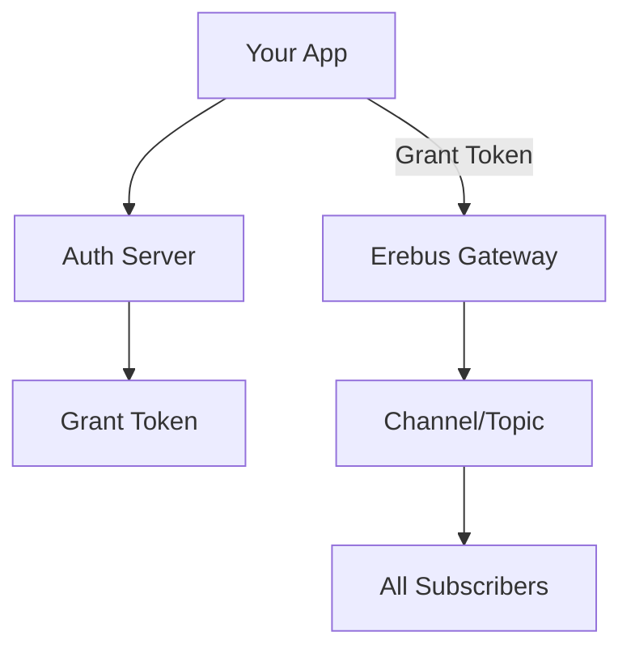

# Quickstart Decision Guide

Welcome to Erebus! This guide helps you choose the right SDK and approach for your real-time application. Whether you're building a chat app, collaborative editor, or notification system, we'll get you started quickly.

## 🚀 Quick Decision Tree

Choose your path based on your project type:

### I'm building a React/Next.js app
→ **[React SDK Quickstart](/docs/get-started/next.js/quickstart-example)** (Experimental)
- Hooks-based API: `useChannel`, `usePresence`
- Declarative subscriptions with React patterns
- Built-in state management

### I'm building any other app (Node.js, Vue, Vanilla JS, etc.)
→ **[Core SDK Quickstart](/docs/get-started/core/quickstart-example)** (Stable)
- Framework-agnostic TypeScript/JavaScript SDK
- Direct WebSocket connection management
- Full control over connection lifecycle

### I want maximum type safety
→ **[Schema Facade Guide](/docs/sdk/core/schema-facade)**
- Runtime validation with Zod schemas
- Compile-time type checking
- Prevents payload mismatches

---

## 🏗️ Architecture Overview

Understanding how Erebus fits into your application:

### Client-Server Flow



### Key Components

| Component | Purpose | Your Responsibility |
|-----------|---------|-------------------|
| **Client SDK** | Real-time messaging | Import and configure |
| **Auth Server** | Issue grant tokens | Implement authorization logic |
| **Erebus Gateway** | Message routing | Nothing (managed service) |
| **Channels/Topics** | Message organization | Design topic structure |

---

## 🎯 Use Case Examples

### Real-time Chat

**Best SDK**: Core SDK or React SDK
**Key Features**: Messages, presence, history

```ts
// Subscribe to chat messages
await client.subscribe("chat:room-123", (msg) => {
  addMessageToUI(msg.senderId, msg.payload);
});

// Track who's online  
await client.onPresence("chat:room-123", (presence) => {
  updateUserList(presence.clientId, presence.status);
});

// Send messages
await client.publish("chat:room-123", "Hello everyone! 👋");
```

### Live Notifications

**Best SDK**: Core SDK
**Key Features**: Targeted publishing, acknowledgments

```ts
// Subscribe to user-specific notifications
await client.subscribe(`user-${currentUserId}`, (msg) => {
  showNotification(JSON.parse(msg.payload));
});

// Send notification with delivery confirmation
await client.publishWithAck(
  `user-${targetUserId}`,
  JSON.stringify({ title: "New Message", body: "Alice sent you a message" }),
  (ack) => console.log("Notification delivered:", ack.success)
);
```

### Collaborative Editing

**Best SDK**: Schema Facade (for type safety)
**Key Features**: Operational transforms, conflict resolution

```ts
// Define schema for edit operations
const editSchema = z.object({
  type: z.enum(["insert", "delete", "format"]),
  position: z.number(),
  content: z.string(),
  author: z.string()
});

const typedClient = new ErebusPubSubSchemas(client, { edit: editSchema });

// Subscribe to document changes
await typedClient.subscribe("edit", `doc-${documentId}`, (msg) => {
  applyOperation(msg.payload); // Fully typed payload
});

// Broadcast changes
typedClient.publish("edit", `doc-${documentId}`, {
  type: "insert",
  position: cursorPosition,
  content: "new text",
  author: currentUserId
});
```

### Live Dashboard

**Best SDK**: Core SDK
**Key Features**: High-frequency updates, multiple data streams

```ts
// Subscribe to multiple data streams
const topics = ["metrics", "alerts", "user-activity"];

for (const topic of topics) {
  await client.subscribe(topic, (msg) => {
    updateDashboard(topic, JSON.parse(msg.payload));
  });
}

// Real-time metrics publishing
setInterval(() => {
  const metrics = collectMetrics();
  client.publish("metrics", JSON.stringify(metrics));
}, 1000);
```

---

## 🔧 Environment Setup

### Development Setup

1. **Install Erebus SDK**
   ```bash
   npm install @erebus-sh/sdk
   ```

2. **Create environment configuration**
   ```bash title=".env.local"
   SECRET_API_KEY=your_api_key_here
   EREBUS_AUTH_URL=http://localhost:4919
   EREBUS_WS_URL=ws://localhost:8787
   ```

3. **Set up TypeScript** (recommended)
   ```json title="tsconfig.json"
   {
     "compilerOptions": {
       "target": "ES2022",
       "module": "ESNext",
       "moduleResolution": "bundler",
       "strict": true
     }
   }
   ```

### Production Checklist

- [ ] Environment variables configured
- [ ] Auth server deployed and accessible
- [ ] Error handling implemented
- [ ] Connection retry logic added
- [ ] Graceful shutdown handling
- [ ] Monitoring and logging set up

---

## 📦 Deployment Examples

### Vercel (Next.js)

```yaml title="vercel.json"
{
  "functions": {
    "app/api/erebus/[...all]/route.ts": {
      "maxDuration": 30
    }
  },
  "env": {
    "SECRET_API_KEY": "@secret_api_key",
    "EREBUS_AUTH_URL": "https://your-app.vercel.app"
  }
}
```

### Netlify

```toml title="netlify.toml"
[build]
  functions = "netlify/functions"

[[env]]
  SECRET_API_KEY = "your_api_key_here"
  EREBUS_AUTH_URL = "https://your-app.netlify.app"
```

### Docker

```dockerfile title="Dockerfile"
FROM node:18-alpine

WORKDIR /app
COPY package*.json ./
RUN npm ci --only=production

COPY . .

ENV NODE_ENV=production
ENV SECRET_API_KEY=${SECRET_API_KEY}
ENV EREBUS_AUTH_URL=${EREBUS_AUTH_URL}

EXPOSE 3000
CMD ["npm", "start"]
```

### Railway

```yaml title="railway.yml"
deploy:
  startCommand: npm start
  healthcheckPath: /health

env:
  SECRET_API_KEY: ${{ SECRET_API_KEY }}
  EREBUS_AUTH_URL: https://${{ RAILWAY_PUBLIC_DOMAIN }}
```

---

## ⚡ Performance Considerations

### When to Use Core SDK vs React SDK

| Factor | Core SDK | React SDK |
|--------|----------|-----------|
| **Performance** | ✅ Maximum control | ⚠️ React overhead |
| **Bundle Size** | ✅ Minimal | ⚠️ React dependencies |
| **Developer Experience** | ⚠️ Manual state management | ✅ React patterns |
| **Stability** | ✅ Stable API | ⚠️ Experimental |
| **Framework** | ✅ Any framework | ❌ React only |

### Message Volume Guidelines

| Volume | Recommended Pattern | Notes |
|--------|-------------------|-------|
| Low (< 10/sec) | Direct publish/subscribe | Simple and straightforward |
| Medium (10-100/sec) | Message batching | Reduce network overhead |
| High (> 100/sec) | Buffering + debouncing | Consider rate limiting |

---

## 🛠️ Common Patterns

### Event-Driven Architecture

```ts
// Central event manager
class EventManager {
  constructor(private client: ErebusPubSubClient) {}
  
  // Emit events
  async emit(event: string, data: unknown) {
    await this.client.publish(`events:${event}`, JSON.stringify(data));
  }
  
  // Listen for events
  async on(event: string, handler: (data: unknown) => void) {
    await this.client.subscribe(`events:${event}`, (msg) => {
      handler(JSON.parse(msg.payload));
    });
  }
}
```

### Request-Response Pattern

```ts
// Request-response over pub/sub
async function makeRequest(requestId: string, data: unknown): Promise<unknown> {
  const responsePromise = new Promise((resolve) => {
    const handler = (msg: MessageBody) => {
      const response = JSON.parse(msg.payload);
      if (response.requestId === requestId) {
        client.unsubscribe(`response:${requestId}`);
        resolve(response.data);
      }
    };
    
    client.subscribe(`response:${requestId}`, handler);
  });
  
  // Send request
  await client.publish(`request:service`, JSON.stringify({
    requestId,
    data
  }));
  
  return responsePromise;
}
```

### Fan-out Notifications

```ts
// Send to multiple users efficiently
async function notifyUsers(userIds: string[], notification: unknown) {
  // Option 1: Individual topics
  await Promise.all(
    userIds.map(userId => 
      client.publish(`user:${userId}`, JSON.stringify(notification))
    )
  );
  
  // Option 2: Broadcast topic with filtering
  await client.publish("broadcast:notifications", JSON.stringify({
    targetUsers: userIds,
    ...notification
  }));
}
```

---

## 🚦 Getting Started Paths

### Path 1: Simple Integration (5 minutes)
1. **[Install SDK](/docs/get-started/install)** - Basic installation
2. **[Core Quickstart](/docs/get-started/core/quickstart-example)** - Working example  
3. **[Deploy](/docs/deployment)** - Push to production

### Path 2: Type-Safe Development (15 minutes)
1. **[Install SDK](/docs/get-started/install)** - Basic installation
2. **[Schema Facade](/docs/sdk/core/schema-facade)** - Type-safe messaging
3. **[Advanced Patterns](/docs/sdk/core/messaging)** - Production patterns

### Path 3: React Integration (10 minutes)
1. **[Install SDK](/docs/get-started/install)** - Basic installation  
2. **[React Quickstart](/docs/get-started/next.js/quickstart-example)** - Next.js example
3. **[Hooks Reference](/docs/sdk/react/hooks)** - Coming soon

---

## 🔗 Quick Links

| Resource | Description |
|----------|-------------|
| **[Complete API Reference](/docs/sdk/core/messaging)** | All methods and types |
| **[Examples Repository](https://github.com/erebus-sh/erebus/tree/master/examples)** | Working code examples |
| **[Schema Validation](/docs/sdk/core/schema-facade)** | Type-safe messaging |
| **[Message History](/docs/sdk/core/history)** | Historical message retrieval |
| **[Error Handling](/docs/sdk/core/connection-management#error-handling)** | Robust error patterns |
